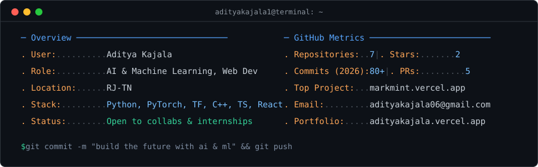



<!-- ── ANIMATED HEADER & CYBER BACKGROUND ─────────────────────── -->

 

 

 

<!-- ── ABOUT ─────────────────────────────────────────────────── -->

<h2 align="center">ABOUT</h2>

  

 

<!-- ── FEATURED PROJECTS ─────────────────────────────────────── -->

<h2 align="center">PROJECTS</h2>

<table>
<tr>
<td width="50%" valign="top">

<h3 align="center">Markmint</h3>

  

  
  
  

Next-generation modern Markdown productivity tool and editor designed for speed, clarity, and developer workflows. Live at <a href="https://markmint.vercel.app">markmint.vercel.app</a>.

</td>
<td width="50%" valign="top">

<h3 align="center">Hostel Wallet</h3>

  

  
  
  

Smart digital expense management and budget tracking application tailored for campus students and shared living arrangements.

</td>
</tr>
<tr>
<td width="50%" valign="top">

<h3 align="center">Developer Portfolio</h3>

  

  
  
  

Personal interactive developer portfolio highlighting AI projects, technical skills, and software engineering experience. Live at <a href="https://adityakajala1.github.io/portfolio/">adityakajala1.github.io/portfolio</a>.

</td>
<td width="50%" valign="top">

<h3 align="center">More Projects</h3>

  

Actively exploring real-world applications of AI/ML, neural architectures, and intelligent web systems — always building, always shipping.

</td>
</tr>
</table>

 

<!-- ── LANGUAGES & TOOLS ─────────────────────────────────────── -->

<h2 align="center">LANGUAGES & TOOLS</h2>

  

 

<!-- ── ACHIEVEMENTS ──────────────────────────────────────────── -->

<h2 align="center">ACHIEVEMENTS</h2>

  <a href="https://github.com/adityakajala1?tab=achievements">
    
    &ensp;
    
    &ensp;
    
    &ensp;
    
  </a>

 

<!-- ── ACTIVITY & CONTRIBUTIONS ──────────────────────────────── -->

<h2 align="center">ACTIVITY & CONTRIBUTIONS</h2>

  

<picture>
  <source media="(prefers-color-scheme: dark)" srcset="https://raw.githubusercontent.com/adityakajala1/adityakajala1/output/github-contribution-grid-snake-dark.svg">
  
</picture>

 

<!-- ── CONNECT ────────────────────────────────────────────────── -->

<h2 align="center">CONNECT</h2>

&ensp;

&ensp;

&ensp;

 
